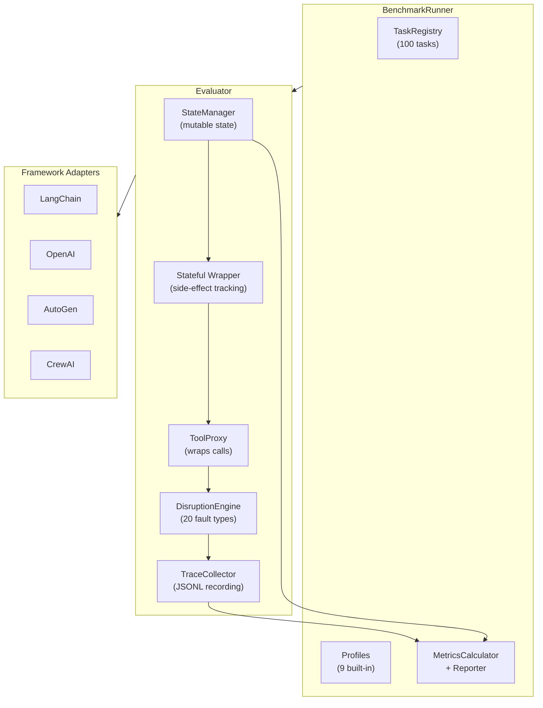
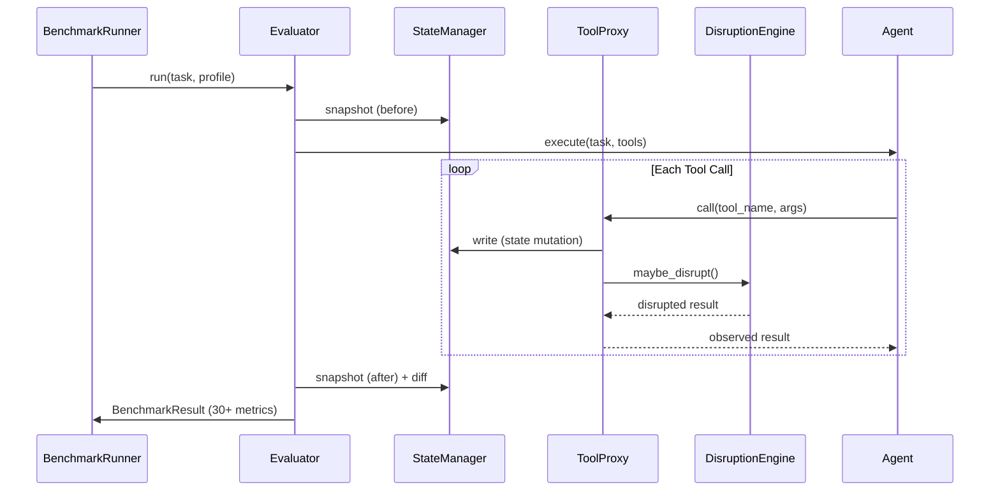
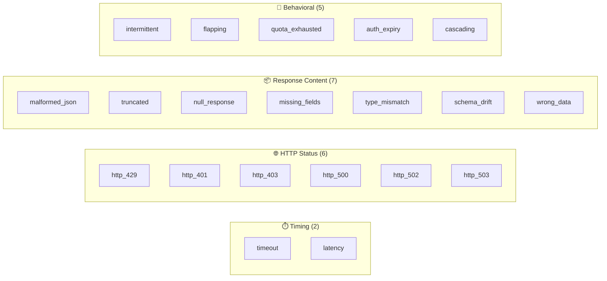
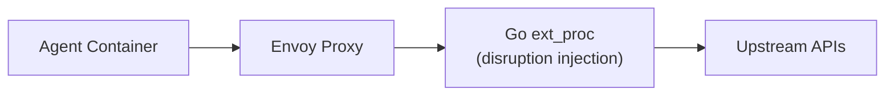

<div align="center">

# AgentDisruptBench

**A Benchmark for Evaluating AI Agent Resilience Under Runtime Disruptions**

[](https://www.python.org/downloads/)
[](https://opensource.org/licenses/MIT)
[](https://arxiv.org/)

</div>

---

## Abstract

Large language model (LLM) agents increasingly rely on external tool calls to complete real-world tasks. While existing benchmarks evaluate *whether* agents can use tools, they assume tools behave perfectly — an assumption that breaks down in production environments where APIs time out, return malformed responses, enforce rate limits, and cascade failures.

**AgentDisruptBench** introduces a systematic benchmark for measuring how well AI agents handle _runtime disruptions_ to their tool calls. By injecting 20 carefully designed fault types across 100 tasks in 4 domains, AgentDisruptBench produces a reliability surface that captures recovery rate, retry efficiency, graceful degradation, side-effect safety, and compensation metrics that go far beyond simple success/failure.

> **Target venue:** NeurIPS 2026 — Datasets and Benchmarks Track

---

## Key Contributions

1. **A Taxonomy of 20 Runtime Disruptions** spanning timing faults, HTTP errors, response corruption, and complex behavioral patterns (cascading failures, flapping services, quota exhaustion).

2. **100 Benchmark Tasks** across 4 domains (Retail, Travel, Finance, DevOps), including 80 standard tasks, 8 adversarial trap tasks, 8 impossible tasks, and 4 handover tasks.

3. **Stateful Sandbox** with mutable in-memory state, compensation detection (entity-level pairing), idempotency violation detection, and side-effect scoring.

4. **R(k,ε,λ) Reliability Surface** — multi-seed, multi-profile evaluation producing a mathematically rigorous composite reliability score.

5. **Recovery Strategy Classification** — categorizes *how* agents recover (RETRY, ALTERNATIVE, ESCALATION, GIVEUP, LUCKY), not just *whether* they recover.

6. **AgentRx-Aligned Failure Taxonomy** — 9-category root-cause attribution mapped from trace disruptions.

7. **9 Built-in Disruption Profiles** from `clean` (no disruptions) to `hostile_environment` (cascading failures).

8. **Framework Adapters** for LangChain/LangGraph, OpenAI Function Calling, AutoGen, and CrewAI.

---

## Architecture



---

## Evaluation Pipeline



---

## Disruption Taxonomy



---

## Quick Start

### Installation

```bash
# Clone the repository
git clone https://github.com/Kavirubc/AgentDisruptBench.git
cd AgentDisruptBench

# Set up virtual environment
python -m venv .venv
source .venv/bin/activate  # or .venv\Scripts\activate on Windows

# Install core package
pip install -e .

# Install with framework support
pip install -e ".[langchain]"    # LangChain / LangGraph
pip install -e ".[openai]"      # OpenAI Function Calling
pip install -e ".[all]"         # All frameworks
pip install -e ".[dev]"         # Development tools
```

### Run the Example

```bash
python examples/quickstart.py
```

### Minimal Usage

```python
from agentdisruptbench import (
    BenchmarkRunner, BenchmarkConfig,
    TaskRegistry, ToolRegistry,
)

# Define your agent (must follow the contract: (task, tools) → str)
def my_agent(task, tools):
    results = []
    for tool_name in task.required_tools:
        try:
            result = tools[tool_name](query="test")
            results.append(f"OK: {result}")
        except Exception as e:
            results.append(f"Error: {e}")
    return "\n".join(results)

# Run benchmark
runner = BenchmarkRunner(
    agent_fn=my_agent,
    task_registry=TaskRegistry.from_builtin(),
    tool_registry=ToolRegistry.from_mock_tools(),
    config=BenchmarkConfig(
        profiles=["clean", "moderate_production", "hostile_environment"],
        seeds=[42, 123],
    ),
)
results = runner.run_all()

# Generate report
from agentdisruptbench import Reporter
Reporter("results").generate(results)
```

---

## Built-in Profiles

| Profile | Description | Key Disruptions |
|---------|-------------|----------------|
| `clean` | No disruptions (baseline) | — |
| `mild_production` | Typical production noise | 10% latency, 3% rate-limit |
| `moderate_production` | Moderate reliability issues | 7% timeout, 8% rate-limit, 5% HTTP 500 |
| `hostile_environment` | Extreme stress test | 15% timeout, 12% rate-limit, 10% malformed |
| `auth_pressure` | Authentication failures | 10% HTTP 401, auth expiry after 4 calls |
| `quota_pressure` | Rate limiting pressure | 15% HTTP 429, quota after 6 calls |
| `data_corruption` | Response data corruption | 15% wrong data, 15% missing fields |
| `cascading_failure` | Downstream failure cascade | Full cascade from payment → dependents |
| `flapping_services` | Unstable services | 50% flapping, intermittent every 3rd call |

---

## Domains and Tasks

| Domain | Tools | Standard | Adversarial | Impossible | Handover | Total |
|--------|:-----:|:--------:|:-----------:|:----------:|:--------:|:-----:|
| **Retail** | 8 | 20 | 2 | 2 | 1 | 25 |
| **Travel** | 8 | 20 | 2 | 2 | 1 | 25 |
| **Finance** | 6 | 20 | 2 | 2 | 1 | 25 |
| **DevOps** | 8 | 20 | 2 | 2 | 1 | 25 |
| **Total** | **30** | **80** | **8** | **8** | **4** | **100** |

### Task Types

| Type | Description | Success Criteria |
|------|-------------|-----------------|
| **Standard** | Normal tasks with recovery paths | `partial_score ≥ 0.8` or exact answer match |
| **Adversarial** | Greedy-best action leads to later failure | Avoiding the trap + completing the task |
| **Impossible** | No valid solution exists | Agent recognizes impossibility + doesn't call forbidden tools |
| **Handover** | Correct action = escalate to human | Agent recommends human handoff |

---

## Metrics

### Core Metrics

| Metric | Definition |
|--------|-----------|
| **Task Success** | `partial_score ≥ 0.8` or exact match on ground truth |
| **Partial Score** | Weighted sum of evaluation rubric criteria |
| **Resilience Ratio** | `success_disrupted / success_clean` |
| **Recovery Rate** | `recovered_failures / total_failures` |
| **Retry Efficiency** | `successful_retries / total_retries` |
| **Mean Steps to Recovery** | Avg tool calls between failure and recovery |
| **Graceful Degradation** | Agent acknowledged failure to user |
| **Cost of Resilience** | Extra tool calls and latency vs. clean baseline |

### Stateful Metrics (P0)

| Metric | Definition |
|--------|-----------|
| **Compensation Count** | Entity-level pairing of side-effect + undo (e.g. `book_flight` → `cancel_booking`) |
| **Side-Effect Score** | Normalized unresolved state changes (0.0–1.0), excludes compensated changes |
| **Idempotency Violations** | Duplicate create operations from retries |
| **Loop Count** | Repeated identical tool calls (≥3 consecutive) |

### P1 Metrics

| Metric | Definition |
|--------|-----------|
| **Graceful Giveup** | Agent correctly identified impossible task |
| **Recovery Strategies** | Classification: RETRY, ALTERNATIVE, ESCALATION, GIVEUP, LUCKY |
| **Dominant Strategy** | Most common recovery strategy used |

### Reliability Surface

| Axis | Definition |
|------|-----------|
| **k-consistency** | Pass rate over repeated seeds for same (task, profile) |
| **ε-robustness** | Pass rate across task-wording variants (placeholder) |
| **λ-fault-tolerance** | Pass rate across disruption profiles |
| **R(k,ε,λ)** | Composite = k × ε × λ |

### P2 Metrics

| Metric | Definition |
|--------|-----------|
| **Planning Time Ratio** | Time before first tool call / total duration |
| **Handover Detected** | Agent recommended human escalation |
| **Hallucination Rate** | Agent claimed actions vs. actual trace records |
| **Failure Categories** | AgentRx-aligned 9-category taxonomy |

---

## Framework Adapters

### LangChain / LangGraph

```python
from agentdisruptbench.adapters.langchain import LangChainAdapter

adapter = LangChainAdapter(engine, trace_collector)
wrapped_tools = adapter.wrap_tools(langchain_tools)
# Use wrapped_tools with your agent / ToolNode
```

### OpenAI Function Calling

```python
from agentdisruptbench.adapters.openai import OpenAIAdapter

adapter = OpenAIAdapter(engine, trace_collector)
messages = adapter.build_tool_messages(tool_calls, tool_registry)
```

### AutoGen

```python
from agentdisruptbench.adapters.autogen import AutoGenAdapter

adapter = AutoGenAdapter(engine, trace_collector)
wrapped_map = adapter.wrap_tools(agent.function_map)
```

### CrewAI

```python
from agentdisruptbench.adapters.crewai import CrewAIAdapter

adapter = CrewAIAdapter(engine, trace_collector)
wrapped_tools = adapter.wrap_tools(crewai_tools)
```

---

## Evaluation Runners

AgentDisruptBench provides **self-contained evaluation runners** that run full LLM agent loops out of the box.

| Runner | Framework | LLM Required | Install |
|--------|-----------|:------------:|---------|
| `simple` | Rule-based baseline | ❌ | Built-in |
| `openai` | OpenAI function calling | ✅ | `pip install openai` |
| `langchain` | LangChain ReAct agent | ✅ | `pip install langchain-openai langgraph` |
| `autogen` | AutoGen two-agent pattern | ✅ | `pip install pyautogen` |
| `crewai` | CrewAI Crew + Agent | ✅ | `pip install crewai` |

### CLI Usage

```bash
# Simple baseline (no API key needed)
python -m evaluation.run_benchmark --runner simple --profiles clean mild_production

# OpenAI GPT-4o on retail tasks only
python -m evaluation.run_benchmark --runner openai --model gpt-4o --domains retail

# LangChain with hostile environment
python -m evaluation.run_benchmark --runner langchain --profiles clean hostile_environment --max-difficulty 3

# AutoGen on finance domain
python -m evaluation.run_benchmark --runner autogen --model gpt-4o --domains finance --seeds 42 123

# See all options
python -m evaluation.run_benchmark --help
```

### Writing Your Own Runner

Extend `BaseAgentRunner` and implement `run_task()`:

```python
from evaluation.base_runner import BaseAgentRunner, RunnerConfig

class MyRunner(BaseAgentRunner):
    def run_task(self, task, tools):
        # Your agent logic here
        # task.description has the task text
        # tools is a dict of name → callable (may be disrupted)
        for name, fn in tools.items():
            result = fn(**my_args)  # Call tools
        return "Final answer from my agent"
```

---

## Project Structure

```
AgentDisruptBench/
├── python/agentdisruptbench/
│   ├── __init__.py              # Public API
│   ├── core/
│   │   ├── engine.py            # DisruptionEngine (20 types)
│   │   ├── trace.py             # TraceCollector + ToolCallTrace
│   │   ├── proxy.py             # ToolProxy wrapper
│   │   ├── profiles.py          # 9 built-in profiles + YAML loader
│   │   ├── metrics.py           # MetricsCalculator + BenchmarkResult
│   │   ├── state.py             # StateManager (mutable sandbox)
│   │   └── reliability.py       # R(k,ε,λ) reliability surface
│   ├── tasks/
│   │   ├── schemas.py           # Task, ToolSchema, GroundTruth
│   │   ├── registry.py          # TaskRegistry (YAML loading)
│   │   ├── generator.py         # SyntheticTaskGenerator
│   │   └── builtin/             # 100 YAML tasks (7 YAML files)
│   │       ├── retail.yaml      # 20 standard retail tasks
│   │       ├── travel.yaml      # 20 standard travel tasks
│   │       ├── finance.yaml     # 20 standard finance tasks
│   │       ├── devops.yaml      # 20 standard devops tasks
│   │       ├── adversarial.yaml # 8 adversarial trap tasks
│   │       ├── impossible.yaml  # 8 impossible tasks
│   │       └── handover.yaml    # 4 handover tasks
│   ├── tools/
│   │   ├── mock_tools.py        # 30 deterministic mock tools
│   │   ├── stateful.py          # Stateful wrapper (side-effect tracking)
│   │   └── registry.py          # ToolRegistry
│   ├── adapters/
│   │   ├── base.py              # BaseAdapter ABC
│   │   ├── langchain.py         # LangChain / LangGraph
│   │   ├── openai.py            # OpenAI Function Calling
│   │   ├── autogen.py           # AutoGen 0.2 / 0.4
│   │   └── crewai.py            # CrewAI
│   └── harness/
│       ├── evaluator.py         # Single-run evaluator
│       ├── runner.py            # BenchmarkRunner
│       └── reporter.py          # Markdown + JSON reports
├── evaluation/                  # Self-contained evaluation runners
│   ├── base_runner.py           # BaseAgentRunner ABC
│   ├── run_benchmark.py         # CLI entry point
│   └── runners/
│       ├── simple_runner.py     # No-LLM baseline
│       ├── openai_runner.py     # OpenAI function calling
│       ├── langchain_runner.py  # LangChain ReAct agent
│       ├── autogen_runner.py    # AutoGen two-agent
│       └── crewai_runner.py     # CrewAI Crew + Agent
├── network/                     # Track B: Go + Envoy (coming soon)
├── examples/
│   └── quickstart.py            # Getting started example
├── tests/                       # Unit tests (87 tests)
├── pyproject.toml               # Build configuration
└── README.md                    # This file
```

---

## Track B: Network Layer (Coming Soon)

Track B provides a **Docker Compose environment** where an Envoy sidecar proxy intercepts all agent HTTP traffic transparently via a Go gRPC external processor. No changes to agent code are required.



---

## Related Work

AgentDisruptBench builds on and complements several existing benchmarks:

- **τ-bench** — Evaluates agent tool-use in simulated retail and airline domains with user interaction. AgentDisruptBench extends this by injecting runtime disruptions into tool responses.
- **REALM-Bench** — Evaluates multi-agent disruption handling at planning time. AgentDisruptBench focuses on _runtime_ disruptions during tool execution.
- **ToolBench / API-Bank** — Catalog-driven benchmarks that test API selection. AgentDisruptBench assumes correct tool selection and tests _execution resilience_.
- **SWE-bench** — Code generation benchmark. Complementary; AgentDisruptBench targets tool-calling agents.
- **ReliabilityBench** — Multi-seed robustness testing. AgentDisruptBench extends with R(k,ε,λ) surface.
- **AgentRx** — Root-cause failure analysis. AgentDisruptBench integrates 9-category failure taxonomy.

---

## Contributing

We welcome contributions! Please see our contribution guidelines:

1. Fork the repository
2. Create a feature branch
3. Follow the mandatory file header convention (see any source file)
4. Write tests for new features
5. Submit a pull request

---

## Citation

If you use AgentDisruptBench in your research, please cite:

```bibtex
@inproceedings{agentdisruptbench2026,
  title     = {AgentDisruptBench: A Benchmark for Evaluating AI Agent
               Resilience Under Runtime Tool-Call Disruptions},
  author    = {AgentDisruptBench Contributors},
  booktitle = {Advances in Neural Information Processing Systems (NeurIPS)
               Datasets and Benchmarks Track},
  year      = {2026},
  url       = {https://github.com/Kavirubc/AgentDisruptBench},
}
```

---

## License

MIT License — see [LICENSE](LICENSE) for details.

---

<div align="center">

**AgentDisruptBench** — *Because real-world tools don't always work.*

</div>